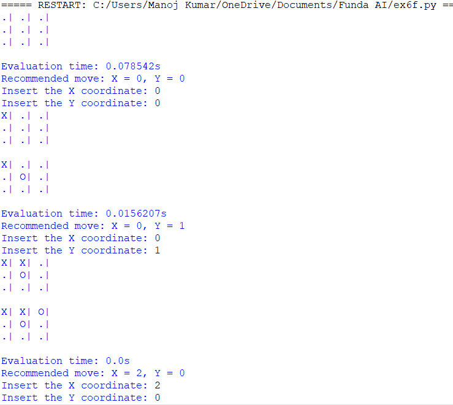

<h1>ExpNo 6 : Implement Alpha-beta pruning of Minimax Search Algorithm for a Simple TIC-TAC-TOE game</h1> 
<h3>Name: Paul Andrew D</h3>
<h3>Register Number: 212221230075</h3>
<H3>Aim:</H3>
<p>
Implement Alpha-beta pruning of Minimax Search Algorithm for a Simple TIC-TAC-TOE game
</p>
<h1>GOALS of Alpha-Beta Pruning in MiniMax Search Algorithm</h1>

<h3>Improve the decision-making efficiency of the computer player by reducing the number of evaluated nodes in the game tree.</h3>
<h3>Tic-Tac-Toe game implementation incorporating the Alpha-Beta pruning and the Minimax algorithm with Python Code.</h3>
<h1>IMPLEMENTATION</h1>

The project involves developing a Tic-Tac-Toe game implementation incorporating the Alpha-Beta pruning with the Minimax algorithm. Using this algorithm, the computer player analyzes the game state, evaluates possible moves, and selects the optimal action based on the anticipated outcomes.

<h1>The Minimax algorithm</h1>

recursively evaluates all possible moves and their potential outcomes, creating a game tree.

<h1>Alpha-Beta pruning</h1>

Alpha–Beta (𝛼−𝛽) algorithm is actually an improved minimax using a heuristic. It stops evaluating a move when it makes sure that it’s worse than a previously examined move. Such moves need not to be evaluated further.

When added to a simple minimax algorithm, it gives the same output but cuts off certain branches that can’t possibly affect the final decision — dramatically improving the performance
<hr>
<h3>Program:</h3>

```python
import time

class Game:
    def __init__(self):
        self.initialize_game()

    def initialize_game(self):
        self.current_state = [['.','.','.'],
                              ['.','.','.'],
                              ['.','.','.']]

        # Player X always plays first
        self.player_turn = 'X'

    def draw_board(self):
        for i in range(0, 3):
            for j in range(0, 3):
                print('{}|'.format(self.current_state[i][j]), end=" ")
            print()
        print()
    def is_valid(self, px, py):
        if px < 0 or px > 2 or py < 0 or py > 2:
            return False
        elif self.current_state[px][py] != '.':
            return False
        else:
            return True
    def is_end(self):
    # Vertical win
        for i in range(0, 3):
            if (self.current_state[0][i] != '.' and
                self.current_state[0][i] == self.current_state[1][i] and
                self.current_state[1][i] == self.current_state[2][i]):
                return self.current_state[0][i]

        # Horizontal win
        for i in range(0, 3):
            if (self.current_state[i] == ['X', 'X', 'X']):
                return 'X'
            elif (self.current_state[i] == ['O', 'O', 'O']):
                return 'O'

    # Main diagonal win
        if (self.current_state[0][0] != '.' and
            self.current_state[0][0] == self.current_state[1][1] and
            self.current_state[0][0] == self.current_state[2][2]):
            return self.current_state[0][0]

    # Second diagonal win
        if (self.current_state[0][2] != '.' and
            self.current_state[0][2] == self.current_state[1][1] and
            self.current_state[0][2] == self.current_state[2][0]):
            return self.current_state[0][2]

    # Is the whole board full?
        for i in range(0, 3):
            for j in range(0, 3):
            # There's an empty field, we continue the game
                if (self.current_state[i][j] == '.'):
                    return None

    # It's a tie!
        return '.'
    def max_alpha_beta(self, alpha, beta):
        maxv = -2
        px = None
        py = None

        result = self.is_end()

        if result == 'X':
            return (-1, 0, 0)
        elif result == 'O':
            return (1, 0, 0)
        elif result == '.':
            return (0, 0, 0)

        for i in range(0, 3):
            for j in range(0, 3):
                if self.current_state[i][j] == '.':
                    self.current_state[i][j] = 'O'
                    (m, min_i, in_j) = self.min_alpha_beta(alpha, beta)
                    if m > maxv:
                        maxv = m
                        px = i
                        py = j
                    self.current_state[i][j] = '.'

                    # Next two ifs in Max and Min are the only difference between regular algorithm and minimax
                    if maxv >= beta:
                        return (maxv, px, py)

                    if maxv > alpha:
                        alpha = maxv

        return (maxv, px, py)

    def min_alpha_beta(self, alpha, beta):

        minv = 2

        qx = None
        qy = None

        result = self.is_end()

        if result == 'X':
            return (-1, 0, 0)
        elif result == 'O':
            return (1, 0, 0)
        elif result == '.':
            return (0, 0, 0)

        for i in range(0, 3):
            for j in range(0, 3):
                if self.current_state[i][j] == '.':
                    self.current_state[i][j] = 'X'
                    (m, max_i, max_j) = self.max_alpha_beta(alpha, beta)
                    if m < minv:
                        minv = m
                        qx = i
                        qy = j
                    self.current_state[i][j] = '.'

                    if minv <= alpha:
                        return (minv, qx, qy)

                    if minv < beta:
                        beta = minv

        return (minv, qx, qy)
    def play_alpha_beta(self):
        while True:
            self.draw_board()
            self.result = self.is_end()

            if self.result != None:
                if self.result == 'X':
                    print('The winner is X!')
                elif self.result == 'O':
                    print('The winner is O!')
                elif self.result == '.':
                    print("It's a tie!")


                self.initialize_game()
                return

            if self.player_turn == 'X':

                while True:
                    start = time.time()
                    (m, qx, qy) = self.min_alpha_beta(-2, 2)
                    end = time.time()
                    print('Evaluation time: {}s'.format(round(end - start, 7)))
                    print('Recommended move: X = {}, Y = {}'.format(qx, qy))

                    px = int(input('Insert the X coordinate: '))
                    py = int(input('Insert the Y coordinate: '))

                    qx = px
                    qy = py

                    if self.is_valid(px, py):
                        self.current_state[px][py] = 'X'
                        self.player_turn = 'O'
                        break
                    else:
                        print('The move is not valid! Try again.')

            else:
                (m, px, py) = self.max_alpha_beta(-2, 2)
                self.current_state[px][py] = 'O'
                self.player_turn = 'X'
def main():
    g = Game()
    g.play_alpha_beta()

if __name__ == "__main__":
    main()
```
<h2>Sample Input and Output:</h2>




<h3>Result:</h3>

Thus the program for implementation of Alpha-beta pruning of Minimax Search Algorithm for a Simple TIC-TAC-TOE game is successfully executed.